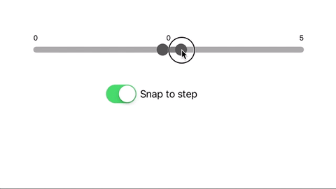

# RxSplitSlider

[](https://travis-ci.org/3ph/RxSplitSlider)
[](http://cocoapods.org/pods/RxSplitSlider)
[](http://cocoapods.org/pods/RxSplitSlider)
[](http://cocoapods.org/pods/RxSplitSlider)


Reactive extension for SplitSlider.

Customizable two way slider split in the middle. Left and right parts are independent, each can have different min,
max, step, colors, etc.



## Usage

Simply add as custom view to storyboard or create programatically. Don't forget to import `SplitSlider` as well.

`let slider = SplitSlider()`

#### Generic slider properties (affects both parts):

`slider.min` - minimal slider value.
`slider.max` - maximal slider value.
`slider.step` - step value of the slider.
`slider.labelFont` - font of the value labels.
`slider.labelTextColor` - font color of the value labels.
`slider.thumbSize` - size of the slider's thumb.
`slider.thumbColor` - color of the thumb.
`slider.trackHeight` - track height.
`slider.trackColor` - track color.
`slider.trackHighlightColor` - color of selected part of the track.
`slider.snapToStep` - determines if thumb should be snapped to the closest step after the move.

All above properties would affect both portions of the slider but can be set individually through either `slider.left` or `slider.right` portion.

#### Observing changes
```
// Slider portion selected - called when user selects (holds) portion of the slider. Return `nil` when no portion is being selected.
splitSlider
    .rx
    .portionSelected
    .asDriver(onErrorJustReturn: nil)
    .drive(onNext: { portion in
        let portionString = portion == self.splitSlider.left ? "left" : "right"
        NSLog("Selected part: \(portion == nil ? "none" : portionString)")
    }).disposed(by: disposeBag)
    
// Slider value changed for portion of slider.
splitSlider
    .rx
    .portionValueChanged
    .asDriver(onErrorJustReturn: (0, SplitSliderPortion()))
    .drive(onNext: { [unowned self] (value, portion) in
        let portionString = portion == self.splitSlider.left ? "left" : "right"
        NSLog("Current value: \(value) (portion: \(portionString))")
    }).disposed(by: disposeBag)
```
## Example

To run the example project, run `pod try`.

## Requirements
iOS 8+.

## Installation

RxSplitSlider is available through [CocoaPods](http://cocoapods.org). To install
it, simply add the following line to your Podfile:

```ruby
pod "RxSplitSlider"
```

## Author

Tomas Friml, instantni.med@gmail.com

## License

RxSplitSlider is available under the MIT license. See the LICENSE file for more info.
